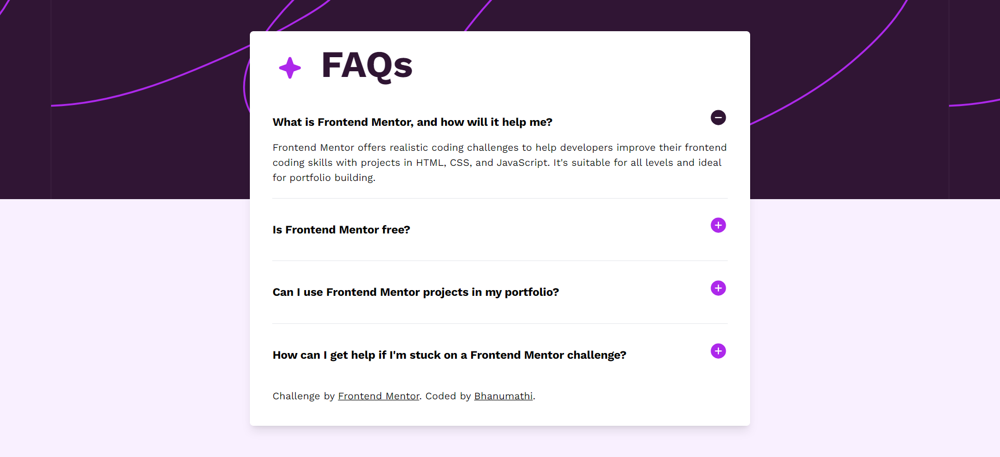

# Frontend Mentor - FAQ accordion solution

This is a solution to the [FAQ accordion challenge on Frontend Mentor](https://www.frontendmentor.io/challenges/faq-accordion-wyfFdeBwBz). Frontend Mentor challenges help you improve your coding skills by building realistic projects. 

## Table of contents

- [Overview](#overview)
  - [The challenge](#the-challenge)
  - [Screenshot](#screenshot)
  - [Links](#links)
  - [Built with](#built-with)
  - [What I learned](#what-i-learned)
  - [Continued development](#continued-development)
  - [Useful resources](#useful-resources)
- [Author](#author)
- [Acknowledgments](#acknowledgments)

## Overview

### The challenge

Users should be able to:

- Hide/Show the answer to a question when the question is clicked
- View the optimal layout for the interface depending on their device's screen size
- See hover and focus states for all interactive elements on the page

### Screenshot

### Links

- Solution URL: (https://github.com/Bhanumathi-a/faq-accordion)
- Live Site URL: (https://65ab680b3181fa569dd2b745--bright-starburst-de0664.netlify.app/)

### Built with

- Semantic HTML5 markup
- CSS custom properties along with Tailwind CSS
- Flexbox
- Mobile-first workflow
- javascript

### What I learned

This is my 1st project with Tailwind CSS. Everything was new to me and loved it

To see how you can add code snippets, see below:

### Continued development

More hands on practices in tailwind CSS and JS.

### Useful resources

- [https://tailwindcss.com/docs/installation]

## Author

- Github - https://github.com/Bhanumathi-a/faq-accordion
- Frontend Mentor - [@yourusername](https://www.frontendmentor.io/profile/yourusername)

## Acknowledgments

This is my first challeng in frontend mentor, and first project in tailwind CSS.
